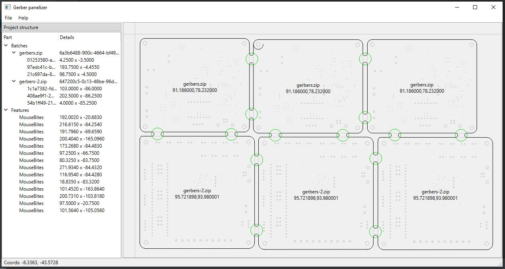
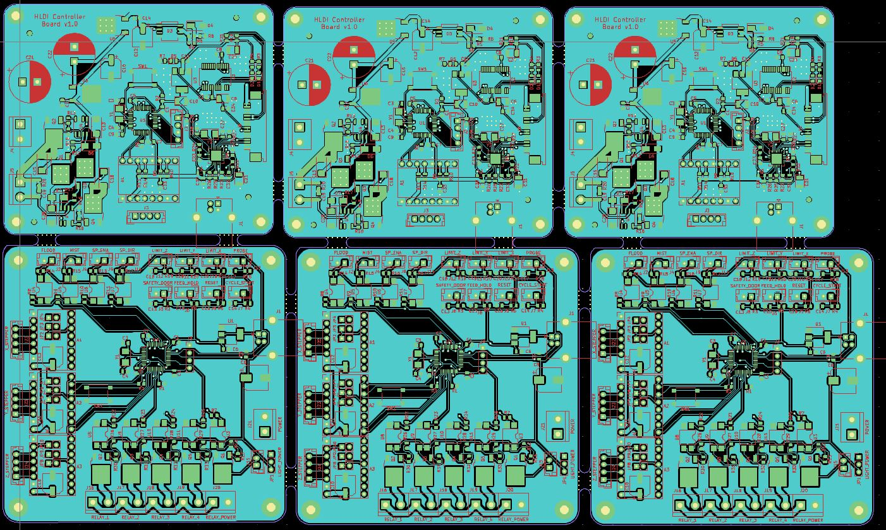

This is a tool to create larger panels from various Gerber archives ready to production.

One screenshot to explain everything:

This software allows:
* adding different PCB designs into one panel
* creating technological joints, so-called mouse bites
* saving / loading panel designs
* and obviously, exporting panel into Gerber ZIP archive

The panel created by this software looks like this (top layers only shown):

---
